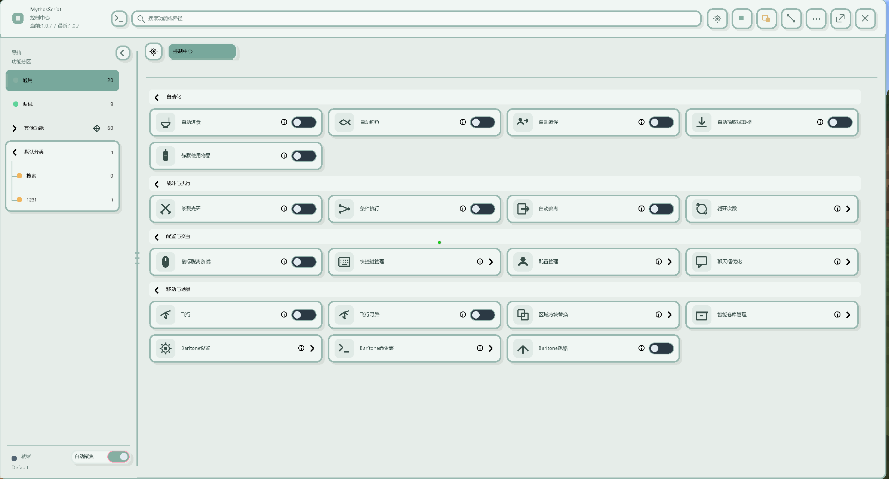
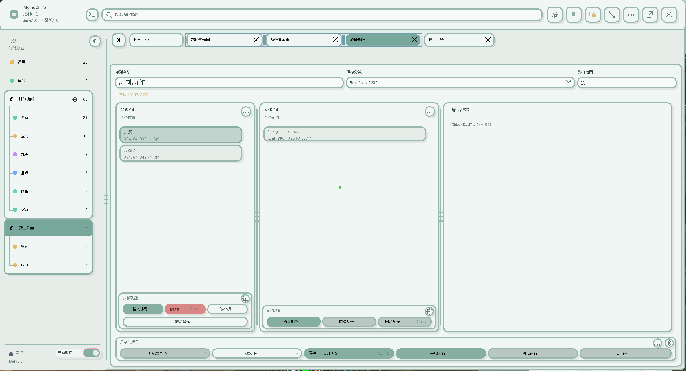
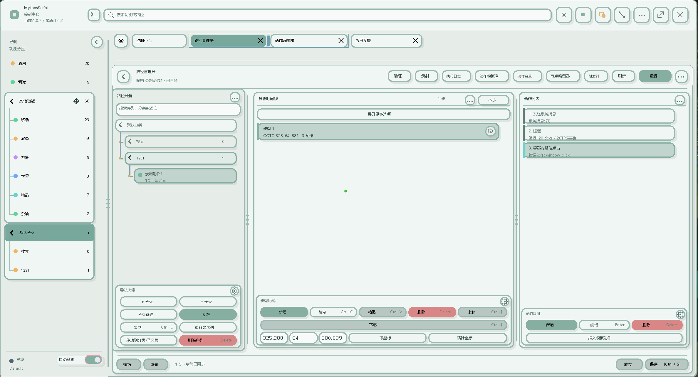
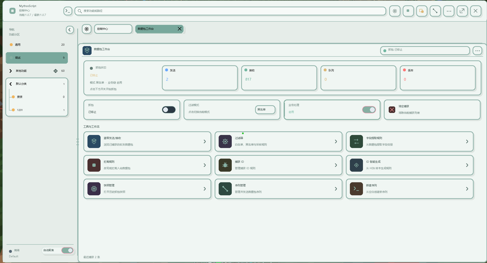
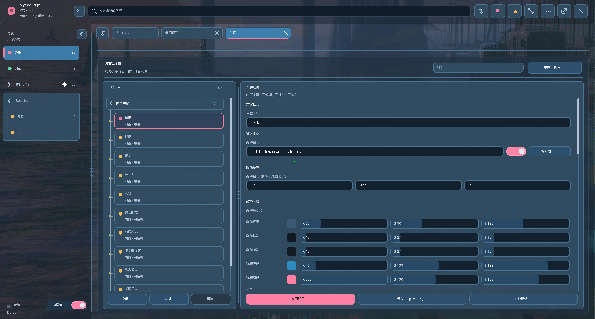
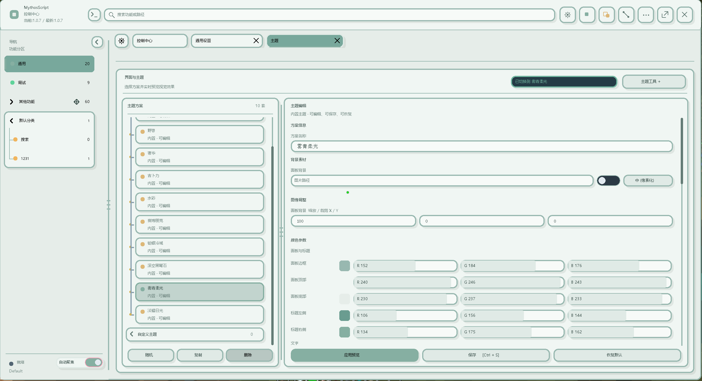
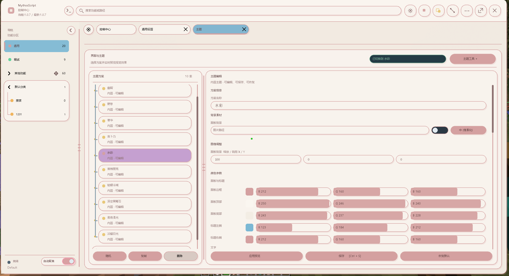
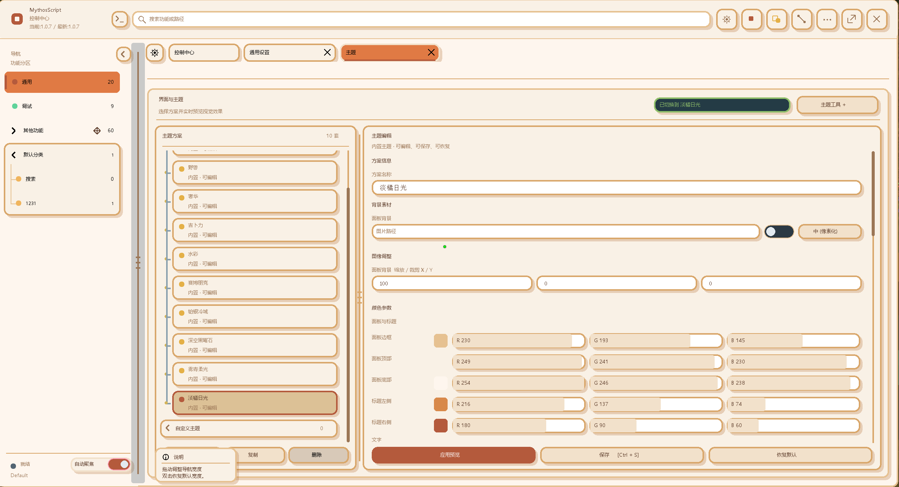
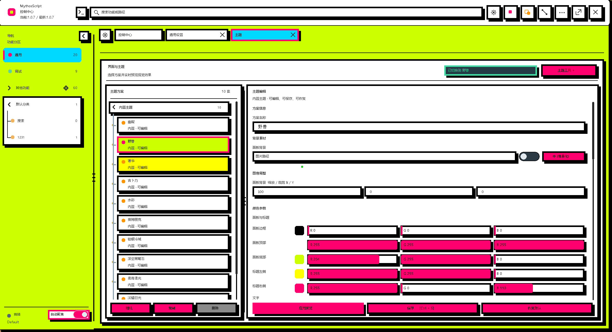

<div align="center">

<p><sub>YOUR WORLD. YOUR WORKFLOW.</sub></p>

<h1>MythosScript</h1>


<h3>把你的想象，编排成世界的下一步。</h3>

<p><a href="README_MCP.md">AI MCP 控制接口与专用 Skill</a></p>

<p>为 Minecraft 打造的可视化自动化工作台<br />从一次操作，到一整套由你定义的游戏流程。</p>

<p>


<a href="LICENSE"></a>
</p>

<p>
<a href="README.md">简体中文</a> ·
<a href="README_EN.md">English</a>
</p>

<p>
<a href="#工作台">探索功能</a> ·
<a href="#数据包工作台">数据包分析</a> ·
<a href="#主题画廊">主题画廊</a> ·
<a href="#开始使用">开始使用</a> ·
<a href="#mcp-安装与使用">MCP 安装与使用</a> ·
<a href="https://github.com/fenda1-1/MythosScript/issues">反馈建议</a>
</p>

<br />

<a href="docs/images/dashboard.png"></a>

<p><sub>MYTHOSSCRIPT / 控制中心 / 雾青柔光</sub></p>

</div>

<br />

## 让想做的事，成为可以运行的流程

探索、移动、交互、整理物品、响应事件——你在游戏中的一个想法，可以从几个动作开始，逐步生长成完整的自动化方案。

**MythosScript 将动作录制、路径序列、节点图、变量和数据包分析放进同一套可视化工作台。** 你可以记录操作、组织步骤，为流程加入条件与触发器，再通过日志和抓包结果继续完善。重复的事情交给脚本，创造的空间留给你。

<table>
<tr>
<td width="33%" valign="top">
<h3>01 / 编排行为</h3>
<p>把移动、交互、等待与物品操作组合成序列。用模板复用经验，用节点图组织更复杂的分支。</p>
</td>
<td width="33%" valign="top">
<h3>02 / 读懂状态</h3>
<p>让变量承接界面、实体、背包与数据包字段；让触发器在事件发生时启动下一步。</p>
</td>
<td width="33%" valign="top">
<h3>03 / 定义体验</h3>
<p>在统一的多标签工作台中管理脚本、配置和主题，把操作习惯与视觉风格一起变成自己的。</p>
</td>
</tr>
</table>

## 工作台

### 从亲手操作，到可重复执行

用动作录制保留操作过程，在路径工作台中继续调整坐标、步骤与参数。分类导航、步骤时间线和动作列表并排展开，让长流程也有清晰的结构。

<table>
<tr>
<td width="50%"><a href="docs/images/action-recording.png"></a></td>
<td width="50%"><a href="docs/images/path-workbench.png"></a></td>
</tr>
<tr>
<td><b>录制动作</b><br /><sub>记录操作，整理步骤，继续编辑。</sub></td>
<td><b>路径序列</b><br /><sub>组合动作，校验参数，运行与复盘。</sub></td>
</tr>
</table>

| 能力 | 你可以如何使用 |
| :--- | :--- |
| **动作与路径** | 组合移动、交互、等待、背包操作与序列调用，保存为可复用的流程。 |
| **节点图与触发器** | 用图组织分支，让聊天、界面、背包或数据包事件驱动执行。 |
| **变量与条件** | 在全局、序列、局部与临时作用域中传递数据，让流程根据状态作出判断。 |
| **调试与迭代** | 查看执行日志、校验动作参数，通过草稿、撤销和重做逐步完善方案。 |
| **配置与分享** | 管理 Profile、导入导出配置，通过分享码和导入预览复用已有方案。 |
| **日常自动化** | 将自动进食、钓鱼、拾取、跟随、仓库管理与 Baritone 能力纳入日常操作。 |

## 数据包工作台

### 看见交互背后的数据，打开更深一层的可能

有些流程难以靠固定坐标点击和延时稳定完成：界面会变化，响应有先后，关键状态也未必直接显示在屏幕上。**数据包分析让你从实际收发的数据出发，理解交互，再设计流程。**

捕获收发数据包、筛选目标消息、提取字段变量，再将结果接入条件判断、事件等待和发送序列。原本难以用普通录制表达的多阶段交互，也能进一步拆解为可观察、可编排的步骤。

<a href="docs/images/packet-workbench.png"></a>

<p align="center"><sub>捕获 → 筛选 → 提取 → 判断 → 执行</sub></p>

| 工作环节 | 对应工具 |
| :--- | :--- |
| **观察交互** | 收发监听、捕获列表、历史快照。 |
| **聚焦目标** | 黑白名单过滤、捕获 ID 规则、基于 HEX 样本生成 ID 规则。 |
| **理解数据** | 字段提取规则，将消息中的信息转成流程可使用的变量。 |
| **编排交互** | 拦截与改写规则、主动发送、数据包序列，以及与动作联动的等待。 |

例如，你可以围绕“发起交互 → 等待目标响应 → 提取字段 → 判断条件 → 继续下一步”构建方案，让执行依据实际状态推进。具体可实现的流程取决于目标协议、服务端逻辑与可用数据。

## 主题画廊

### 强大的工具，也可以有自己的审美

从通透的深色面板，到柔和的浅色工作台，再到高对比的大胆配色。主题编辑器支持背景素材、颜色参数与实时预览，让你在游戏中直接调整界面风格。

<a href="docs/images/theme-indigo.png"></a>

<p align="center"><b>幽靛</b> · 深蓝、通透与一抹粉色。<br /><sub>沉浸于世界，也专注于手中的流程。</sub></p>

<table>
<tr>
<td width="50%"><a href="docs/images/theme-mist.png"></a></td>
<td width="50%"><a href="docs/images/theme-watercolor.png"></a></td>
</tr>
<tr>
<td><b>雾青柔光</b><br /><sub>低饱和青绿，安静而清晰。</sub></td>
<td><b>水彩</b><br /><sub>奶油底色与柔粉线条，轻盈而温和。</sub></td>
</tr>
<tr>
<td><a href="docs/images/theme-sunlight.png"></a></td>
<td><a href="docs/images/theme-beast.png"></a></td>
</tr>
<tr>
<td><b>淡橘日光</b><br /><sub>暖橘与浅杏，让工作台带一点温度。</sub></td>
<td><b>野兽</b><br /><sub>荧光色、硬边框与强烈对比，表达鲜明个性。</sub></td>
</tr>
</table>

<p align="center"><sub>以上均为 v1.0.7 游戏内实拍。点击图片查看原图。</sub></p>

## 开始使用

| 环境 | 版本 |
| :--- | :--- |
| Minecraft | **1.12.2** |
| Forge | **14.23.5.2860** |
| Java | **8** |
| 当前版本 / 主分支 | **v1.0.7** / **1.12.2** |

1. 准备 Minecraft 1.12.2 的 Forge 游戏环境，并使用 Java 8 启动。
2. 将适配的 MythosScript Mod JAR 放入该游戏实例的 `mods` 文件夹。
3. 进入游戏，通过已配置的主菜单快捷键打开控制中心；按键设置可在快捷键管理中调整。
4. 从一段简单录制开始，在路径工作台中检查动作、保存并运行，再逐步加入条件、变量与触发器。

## MCP 安装与使用

MythosScript 提供一个仅监听本机的 MCP 控制接口，让支持 MCP 的 AI 客户端读取游戏状态、查看 GUI、分析数据包，并在确认后执行路径和动作。完整工具目录、参数说明和高级示例见 [MCP 控制接口文档](README_MCP.md)。

### 安装

1. 按上面的步骤安装 Mod，并启动 Minecraft 1.12.2。MCP 服务会按照当前设置运行；默认端点为 `http://127.0.0.1:8765/mcp`。
2. 在游戏右上角打开“工具”→“MCP 控制 / 调试”，确认服务已启用；也可以在那里修改端口并应用。配置保存在游戏实例的 `config/我的世界脚本/mcp_server.json`。
3. 准备 Python 3。仓库内的桥接器只使用 Python 标准库，不需要安装 MCP SDK 或其他依赖。
4. 如果 AI 客户端支持 MCP 的 stdio 配置，将下面的配置加入客户端设置，并把路径替换为本地仓库的绝对路径：

```json
{
  "mcpServers": {
    "mythosscript": {
      "command": "python",
      "args": [
        "C:/path/to/MythosScript/skills/mythosscript-mcp/scripts/client.py",
        "--auto-discover",
        "stdio"
      ]
    }
  }
}
```

自动发现会读取模组写入的机器级端点记录，不需要在 AI 客户端配置中填写游戏目录、端口或 Token 路径。桥接器默认使用 `%LOCALAPPDATA%/MythosScript/mcp-endpoints.json`；Linux/macOS 下可使用 `python3` 代替 `python`。

### 使用

在仓库根目录运行以下命令，可以先检查连接，再查看在线客户端和状态：

```powershell
python skills/mythosscript-mcp/scripts/client.py --auto-discover probe
python skills/mythosscript-mcp/scripts/client.py --auto-discover call mythos_clients
python skills/mythosscript-mcp/scripts/client.py --auto-discover --player Steve call mythos_status
```

先调用 `mythos_clients` 确认目标玩家；同时运行多个 Minecraft 客户端或存在同名玩家时，用 `--pid` 指定进程。MCP Token 会自动生成在游戏配置目录的 `config/我的世界脚本/mcp.token`，只供本机桥接使用，不要复制到提示词、配置示例或仓库中。需要完整操作示例时，请继续阅读 [README_MCP.md](README_MCP.md) 以及 [专用 Skill](skills/mythosscript-mcp/SKILL.md)。

版本与后续发布信息见 [项目发布页](https://github.com/fenda1-1/MythosScript/releases)。

<details>
<summary><b>一些适合开始的思路</b></summary>

- **整理一段重复操作**：录制交互，在工作台中调整步骤和等待条件。
- **让脚本响应世界**：选择一个事件作为入口，根据变量决定后续动作。
- **分析一次复杂交互**：保留抓包快照，筛选目标消息，再尝试提取需要的字段。
- **做一套自己的工作台**：选择主题，调整背景和强调色，配置常用快捷键。

</details>

## 构建与发布

项目使用 Gradle Wrapper，因此无需预先安装 Gradle。构建需要 **JDK 8**；项目会优先读取 `JAVA8_HOME`、`JDK8_HOME` 或 `JAVA_HOME` 中可用的 Java 8 安装。

在仓库根目录运行：

```powershell
.\gradlew.bat build
```

也可以直接双击 `build.bat`，它执行同一条构建命令。构建会先编译、重映射 Forge 名称，然后自动运行 ProGuard。完成后可在 `build/libs/` 找到两个文件：

| 文件 | 用途 |
| :--- | :--- |
| `MythosScript-v1.0.7.jar` | 常规发布包，便于排查问题和开发调试。 |
| `MythosScript-v1.0.7-obf.jar` | 已经过 ProGuard 混淆的发布包，建议作为对外分发版本。 |

两个 JAR 都是 Minecraft 1.12.2 Forge Mod；一次发布只应选择其中一个放入游戏实例的 `mods` 文件夹，不能同时安装。`build` 会在现有工作树上构建，因此发布前请先确认需要包含的本地修改。

如只需生成常规包，可运行：

```powershell
.\gradlew.bat jar reobfJar
```

如已经生成常规包、只需重新生成混淆包，可运行：

```powershell
.\gradlew.bat proguard
```

混淆规则由 `build.gradle` 中的 `proguard` 任务动态生成。它会保留 Forge 入口、事件处理器、GUI、Mixin 和 ShadowBaritone 所需的类与资源，以避免破坏运行时加载；生成的混淆文件名固定以 `-obf.jar` 结尾。

## 交流与反馈

欢迎分享你构建的流程、主题与改进建议。报告问题时，请附上版本、复现步骤，以及相关日志或截图。

<p>
<a href="https://github.com/fenda1-1/MythosScript/issues"></a>
<a href="https://space.bilibili.com/651467617"></a>
<a href="https://qm.qq.com/cgi-bin/qm/qr?k=KpXtB7PNkQYan3sAx-eO4_wa8x9BIRhF&amp;jump_from=webapi&amp;authKey=X/HJE1j5AIGgsOP4zT/8r1SsTD6ptqo4A9/PmbJeeWd3lBolMoNWpCuDHyzxrQTj"></a>
</p>

本项目采用 [GNU LGPL v3.0](LICENSE) 许可证。

---

<div align="center">
<p><b>你的世界，由你编排。</b></p>
<p><sub>MYTHOSSCRIPT · IMAGINE. COMPOSE. PLAY.</sub></p>
</div>
